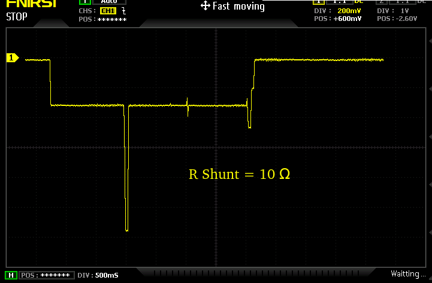

# main
- Versão funcional no envio de LoRaWAN ABP:
    - WCM Versão 0.00.04 04/01/2026 Build: 0004
    - Branch CmdUart
- Utiliza placa WCM com:
    - RFM95W
    - Speed Studio, XIAO ESP32-C3
- Recebe comandos pela UART, nesta versão só está ativo o CMD 'A' (LoRaWAN ABP)

### Comentários
- Os parâmetros LoRaWAN são enviados junto com a linha de comando
- O módulo consome algo como 2,1 segundos para cada transmissão

### Próximos passos
- Documentar o código
- Suporte ao ESP32-C3 Mini Super
- Iniciar testes com OTAA
- Avaliar melhorias no consumo

### Consumo do Módulo WCM com transmissão ABP



## Versão 0.00.05 - 14/01/2026 - Build: 0005
Add Suporte para LoRaWAN OTAA

## Versão 0.00.06 - 25/02/2026 - Build: 0006
- Correção do setting do SF

## Versão 0.00.07 - 25/02/2026 - Build: 0007
- Remoção das mensagens de debug

## Versão 0.00.07c - 26/03/2026 - Build: 0008
- Instruções de Build
    para o lmic funcionar em au915 é necessario editar o arquivo:
        /home/user01/Arduino/libraries/MCCI_LoRaWAN_LMIC_library/project_config/lmic_project_config.h
        para:
```
// project-specific definitions
//#define CFG_eu868 1
//  #define CFG_us915 1
#define CFG_au915 1
//#define CFG_as923 1
// #define LMIC_COUNTRY_CODE LMIC_COUNTRY_CODE_JP      /* for as923-JP; also define CFG_as923 */
//#define CFG_kr920 1
//#define CFG_in866 1
#define CFG_sx1276_radio 1
//#define CFG_sx1261_radio 1
//#define CFG_sx1262_radio 1
//#define ARDUINO_heltec_wifi_lora_32_V3
//#define LMIC_USE_INTERRUPTS
```
## Versão 0.00.08 - 07/04/2026 - Build: 0009
- Add channels:
    - 0xFD  ==> AUTO 0-7
    - 0xFE  ==> AUTO 8-15
    - 0xFF  ==> AUTO 0-15
