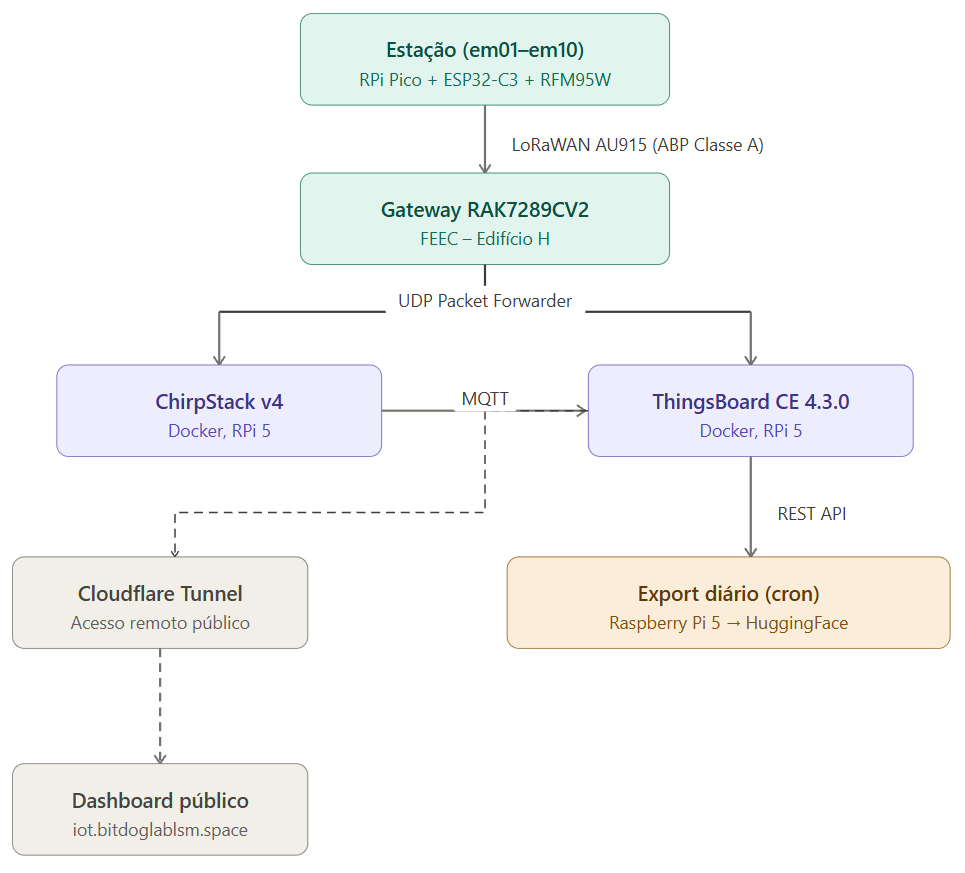

# 📡 Estações Meteorológicas LoRaWAN – UNICAMP

Firmware e infraestrutura de servidor de uma rede de monitoramento ambiental baseada em **LoRaWAN**, implantada no campus da **Universidade Estadual de Campinas (UNICAMP)**. As estações são identificadas de `em01` a `em10` e estão sendo gradualmente implantadas ao longo do campus.

Os dados coletados estão disponíveis publicamente e são atualizados diariamente em: **[HuggingFace Dataset](https://huggingface.co/datasets/adr1t0s/estacao-meteorologica/tree/main)**

---

## 🏗️ Arquitetura do sistema

---

## 📡 Rede LoRaWAN

| Parâmetro | Valor |
|---|---|
| **Gateway** | RAK7289CV2 |
| **Região** | AU915 — sub-bandas 0 e 1 (16 canais) |
| **Modo** | ABP Classe A |
| **Servidor de rede** | ChirpStack v4 (self-hosted, Docker) |
| **ADR** | Ativado — algoritmo default + plugin ML em desenvolvimento |

---

## 🖥️ Servidor

| Componente | Descrição |
|---|---|
| **Hardware** | Raspberry Pi 5 (8 GB RAM) + SSD NVMe 256 GB |
| **OS** | Raspberry Pi OS (64-bit) |
| **ChirpStack v4** | Servidor de rede LoRaWAN (Docker) |
| **ThingsBoard CE 4.3.0** | Plataforma IoT — ingestão, regras e dashboards (Docker) |
| **Mosquitto** | MQTT broker |
| **Cloudflare Tunnel** | Acesso remoto seguro sem exposição de portas |

---

📂 Estrutura do repositório

Estacao_Meteorologica/
├── README.md
├── arquitectura.png
├── ScriptsToDataDailyUpdate/
│   ├── export_for_date.sh      ← exporta dados de uma data específica
│   ├── export_yesterday.sh     ← wrapper que chama export_for_date com ontem
│   ├── run_daily.sh            ← orquestrador do cron: pull → export → push
│   └── config.env              ← privado
└── .gitignore

Os scripts de exportação de dados e os CSVs estão no **[HuggingFace Dataset](https://huggingface.co/datasets/adr1t0s/estacao-meteorologica/tree/main)**, não neste repositório. Os três scripts principais são:

- **`export_for_date.sh`** — recebe uma data (`YYYY-MM-DD`) como argumento, autentica na API REST do ThingsBoard, baixa a telemetria de cada dispositivo ativo e do asset OWM para aquela janela de 24h (fuso `America/Sao_Paulo`), converte os JSONs brutos em CSVs com `jq` e remove os JSONs ao final.
- **`export_yesterday.sh`** — wrapper simples que calcula a data de ontem e chama `export_for_date.sh`. É o ponto de entrada do cron.
- **`run_daily.sh`** — orquestrador diário: faz `git pull --rebase` para receber atualizações dos scripts, chama `export_yesterday.sh`, e se houver dados novos em `data/` faz commit e push para o HuggingFace automaticamente.

---

## 🚧 Estado do projeto

| Componente | Status |
|---|---|
| Rede LoRaWAN operacional | ✅ |
| ADR com persistência NVS | ✅ |
| ChirpStack v4 self-hosted | ✅ |
| ThingsBoard CE com dashboards públicos | ✅ |
| Export automático diário para HuggingFace | ✅ |
| Plugin ML para ADR (ChirpStack JS + FastAPI) | 🔄 em desenvolvimento |
| Mapeamento preditivo de cobertura (Random Forest) | 🔄 em desenvolvimento |

---

## 🔗 Links

- 📦 [Dataset (HuggingFace)](https://huggingface.co/datasets/adr1t0s/estacao-meteorologica/tree/main)
- 📊 [Dashboard público](https://iot.bitdoglablsm.space/dashboard)
- 📡 [ChirpStack v4](https://www.chirpstack.io/docs/getting-started/docker.html)
- 🖥️ [ThingsBoard CE](https://thingsboard.io/docs/installation/docker/)
- 🌐 [Cloudflare Tunnel](https://developers.cloudflare.com/cloudflare-one/connections/connect-networks/)
