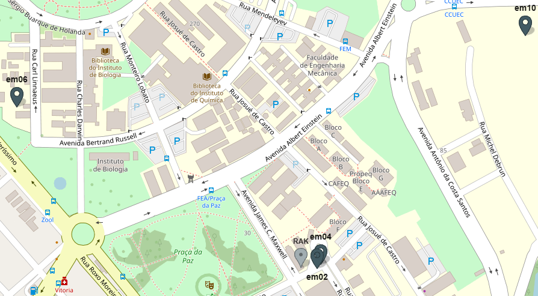

# Comunicação LoRaWAN — Estações Meteorológicas Unicamp

Esta pasta contém os dados de telemetria LoRaWAN coletados pelas estações meteorológicas instaladas no campus da FEEC/Unicamp, juntamente com informações sobre a configuração da rede e a localização dos dispositivos.

---

## Estações

A rede conta com **4 estações simultâneas** operando em modo ABP Classe A sobre LoRaWAN AU915 (sub-bandas 0 e 1, canais 0–15).

| Estação | Dist. GW (m) | Canal | Freq. (MHz) | rfChain | SF | DR | TX Power (dBm) | BW (kHz) | Intervalo (s) | Pacotes (24h) | PDR (%) | RSSI médio (dBm) | SNR médio (dB) | GPS |
|---|---|---|---|---|---|---|---|---|---|---|---|---|---|---|
| em02 | 35 | 8 | 916.8 | 2 | SF7 | DR5 | 14 | 125 | 60 | 1440 | 100.0 | -81.0 | 13.2 | Sim |
| em04 | 45 | 8 | 916.8 | 2 | SF7 | DR5 | 14 | 125 | 600 | 143 | 99.3 | -94.9 | 11.7 | Sim |
| em06 | 606 | 6 | 916.4 | 1 | SF7 | DR5 | 14 | 125 | 60 | 1401 | 97.3 | -103.2 | 1.3 | Não |
| em10 | 605 | 6 | 916.4 | 1 | SF10 | DR2 | 14 | 125 | 60 | 1439 | 99.9 | -89.3 | 10.1 | Não |

### Coordenadas

| Estação | Latitude | Longitude |
|---|---|---|
| em02 | -22.822205 | -47.065704 |
| em04 | -22.822132 | -47.065639 |
| em06 | -22.819542 | -47.071064 |
| em10 | -22.818361 | -47.062000 |
| Gateway | -22.822360 | -47.066000 |

> **em04:** o intervalo de 600 s foi configurado para gestão energética, uma vez que o módulo GPS apresenta consumo elevado, reduzindo a autonomia da bateria durante períodos sem geração solar.  
> **em06 / em10:** operam sem GPS, o que reduz o consumo e permite maior autonomia em campo.

---

## Gateway

| Parâmetro | Valor |
|---|---|
| Modelo | RAK7289CV2 |
| Localização | FEEC – Edifício H, Unicamp |
| Latitude | -22.82236 |
| Longitude | -47.06600 |

---

## Configuração LoRaWAN

| Parâmetro | Valor |
|---|---|
| Região | AU915 |
| Sub-bandas | 0 e 1 (canais 0–15) |
| Método de ativação | ABP (Activation By Personalization) |
| Classe | A |
| Code Rate | CR 4/5 |

---

## Arquivos de telemetria

Os arquivos CSV contêm os dados de telemetria brutos exportados via API REST do ThingsBoard. Cada arquivo corresponde a uma estação e a um período de 24 horas.

| Arquivo | Estação | Período |
|---|---|---|
| `telemetria_em02_2026-06-12_00h00_2026-06-13_00h00.csv` | em02 | 12/06/2026 |
| `telemetria_em04_2026-06-08_00h00_2026-06-09_00h00.csv` | em04 | 08/06/2026 |
| `telemetria_em06_2026-06-12_00h00_2026-06-13_00h00.csv` | em06 | 12/06/2026 |
| `telemetria_em10_2026-06-12_00h00_2026-06-13_00h00.csv` | em10 | 12/06/2026 |

### Colunas

| Coluna | Descrição | Unidade |
|---|---|---|
| `Data/Hora` | Timestamp de recepção no servidor | UTC |
| `RSSI (dBm)` | Received Signal Strength Indicator | dBm |
| `SNR (dB)` | Signal-to-Noise Ratio | dB |
| `Frame Counter` | Contador de quadros LoRaWAN (fCnt) | — |
| `Data Rate` | Data Rate LoRaWAN (DR0–DR5, AU915) | — |

> Registros duplicados (mesmo timestamp e fCnt) foram removidos, mantendo sempre o último registro recebido.

---

## Mapa de localização

Localização do gateway RAK7289CV2 e das quatro estações meteorológicas no campus.
