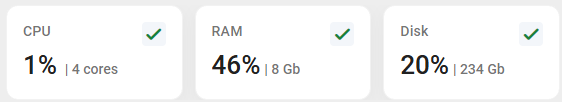
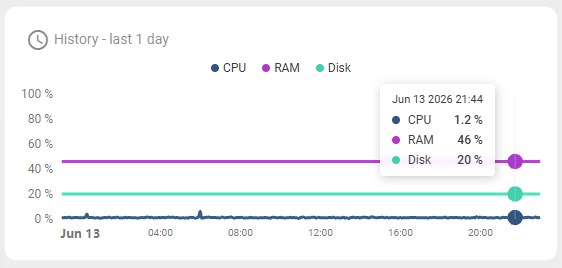
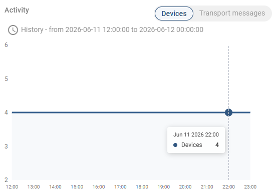
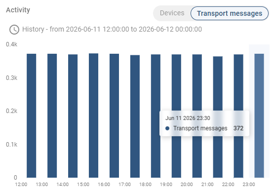
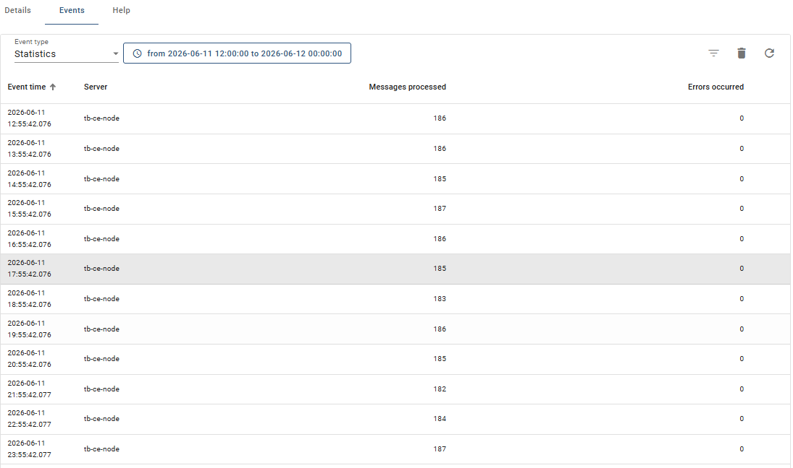

# Infraestrutura Local

Esta pasta contém evidências de operação e monitoramento da infraestrutura local de coleta, processamento e armazenamento de dados meteorológicos.

---

## Visão geral

A infraestrutura é executada em uma **Raspberry Pi 5 (8 GB RAM, 256 GB SSD NVMe)** e opera de forma totalmente local, sem dependência de serviços externos em nuvem. Os seguintes serviços são executados em contêineres Docker:

| Serviço | Função |
|---|---|
| ChirpStack v4 | Servidor de rede LoRaWAN — gerenciamento de dispositivos e processamento de uplinks |
| Mosquitto | Broker MQTT — integração ChirpStack → ThingsBoard |
| ThingsBoard CE 4.3.0 | Armazenamento, visualização e exportação dos dados |
| PostgreSQL | Banco de dados relacional (backend do ThingsBoard) |

O acesso remoto é disponibilizado via **Cloudflare Tunnel**, sem exposição direta de portas na rede institucional.

---

## Período de operação

A coleta de dados está em operação desde **02/02/2026**. Os dados históricos estão disponíveis publicamente no HuggingFace:
👉 https://huggingface.co/datasets/adr1t0s/estacao-meteorologica

---

## Recursos do servidor

Monitoramento realizado via painel sysadmin do ThingsBoard em 13/06/2026.

| Recurso | Valor |
|---|---|
| CPU | ~1% (4 cores) |
| RAM | ~46% de 8 GB |
| Disco | ~20% de 234 GB |

O consumo de recursos permaneceu estável ao longo do dia, sem picos significativos.

---

## Dispositivos ativos e mensagens transportadas

Período de referência: **11/06/2026 12:00 a 12/06/2026 00:00**

| Métrica | Valor |
|---|---|
| Dispositivos ativos | **4** (constante ao longo do período) |
| Transport messages por intervalo de 30 min | ~372 |
| Transport messages por hora | ~744 |

---

## Mensagens processadas pela Rule Engine

Estatísticas do nó **Save Timeseries** da Rule Chain principal (ChirpS Root) no mesmo período.

| Métrica | Valor |
|---|---|
| Mensagens processadas por hora | ~182–187 |
| Esperado teórico (4 estações) | 186 |
| Erros ocorridos | **0** |

Os valores observados são consistentes com a configuração de transmissão das estações (em02, em06, em10 a 60 s e em04 a 600 s), confirmando que nenhuma mensagem foi descartada pela infraestrutura.

---

## Pendente

Os seguintes indicadores serão adicionados assim que houver acesso ao terminal da Raspberry Pi 5:

- **Uptime do sistema** — `uptime -p`
- **Uptime dos contêineres Docker** — `docker ps --format "table {{.Names}}\t{{.Status}}"`
- **Comportamento após reinicialização** — os serviços são configurados com `restart: always` no Docker Compose, garantindo retomada automática; a ser confirmado com logs reais
